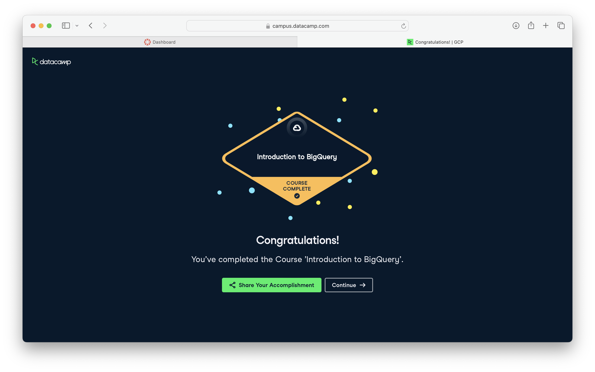

**Course:** IBM 6500 — Customer Insight Methods and Survey Research

# Course-Completion Evidence

I completed DataCamp's Introduction to BigQuery course on September 30, 2026, for IBM 6500. The screenshot below shows the course-completion confirmation.

{width=100%}

# Learning Notes and Key Takeaways

These sections follow the four chapters in the [DataCamp course outline](https://www.datacamp.com/courses/introduction-to-bigquery). The queries use the course's practice `ecommerce` dataset, not Restaurant at Kellogg Ranch data. They are reference examples, not executed queries in this report.

## BigQuery Architecture and Structure

**Main ideas:** BigQuery is Google's cloud data warehouse for analyzing large datasets. Storage and computing are separate, and Google manages the servers. It is useful for large analytical reports. See [Google's BigQuery overview](https://cloud.google.com/bigquery/docs/introduction).

**Terminology and procedures:** A project contains datasets, and datasets contain tables. A schema defines fields and data types. Dataset location matters when loading and combining data. The architecture includes Dremel for query processing, Colossus for storage, Jupiter for networking, and Borg for managing computing resources.

**SQL syntax and example:** `SELECT` chooses columns, `FROM` names the table, and `DISTINCT` removes repeated values.

```sql
SELECT DISTINCT seller_city
FROM ecommerce.ecomm_sellers;
```

**Explanation:** This returns each seller city once. Before querying a new table, I would expand the project and dataset in Explorer, open the table, and check its schema and preview. A full table path uses `project.dataset.table`; these examples use dataset and table names within the course's default project.

**CEP application:** Separate tables could organize our restaurant survey responses, marketing channels, and transactions if those data become available. Checking the schema first would help our group understand what we can analyze.

## Writing queries and data types

**Main ideas:** Familiar SQL still applies, but BigQuery also supports nested data. `DATE` is a calendar date, `DATETIME` is a date and time without a time zone, and `TIMESTAMP` represents an instant. An `ARRAY` holds multiple values; a `STRUCT` groups named fields. `UNNEST()` expands arrays into rows, and dot notation accesses nested fields.

**Procedures and syntax:** For a local CSV, choose the dataset and Create table, select Upload, identify the file and format, choose a destination, and confirm the schema and header settings. Other supported formats include newline-delimited JSON, Avro, Parquet, and ORC. `bq load` and `LOAD DATA` offer other loading methods. `EXTRACT()` retrieves date components, `FORMAT_TIMESTAMP()` formats timestamps, and `SEARCH()` finds tokens in supported string or nested data.

```sql
SELECT o.order_id, item.price
FROM ecommerce.ecomm_orders AS o
JOIN ecommerce.ecomm_order_details AS d USING (order_id)
CROSS JOIN UNNEST(o.order_items) AS item
WHERE EXTRACT(YEAR FROM d.order_purchase_timestamp) = 2017;
```

**Explanation:** This matches orders to their details and returns item prices for orders purchased in 2017. `order_items` is an array of item records. An order with several items produces several rows, so counting the result rows would count items rather than orders. `USING (order_id)` matches the shared identifier.

**CEP application:** Date filters could compare restaurant activity across campaign periods. Nested fields would matter for GA4 event parameters. Survey comments would need different handling from numeric ratings; finding a word alone would not establish sentiment.

## Querying data in BigQuery

**Main ideas:** Aggregations summarize rows. Window functions calculate across related rows while keeping individual rows visible. A common table expression (CTE), introduced with `WITH`, names an intermediate result within a query and makes longer queries easier to follow.

**Terminology and syntax:** `WHERE` filters before grouping, `GROUP BY` defines groups, and `HAVING` filters grouped results. `COUNTIF()` counts true conditions. `STRING_AGG()` combines strings, `ARRAY_CONCAT_AGG()` combines arrays, and `LOGICAL_AND()` or `LOGICAL_OR()` summarizes Boolean values. `ANY_VALUE()` selects an arbitrary value, not necessarily the first or most common. Approximate functions return estimates.

```sql
SELECT payment_installments,
       APPROX_COUNT_DISTINCT(order_id) AS estimated_orders,
       AVG(payment_value) / payment_installments AS avg_installment_value
FROM ecommerce.ecomm_payments
WHERE payment_installments > 0
GROUP BY payment_installments;
```

**Explanation:** This groups payments by installment count, estimates distinct orders, and divides each group's average payment value by its installment count. Excluding zero prevents division by zero. The average describes payment rows, so it should not automatically be called average order value.

**Window example:** `OVER()` defines a window, `PARTITION BY` separates groups, and `ORDER BY` sets their order. `RANK()` ranks rows; `LAG()` and `LEAD()` access previous and next values.

```sql
WITH daily_orders AS (
  SELECT DATE(order_purchase_timestamp) AS order_date,
         COUNT(*) AS order_count
  FROM ecommerce.ecomm_order_details
  GROUP BY order_date
)
SELECT order_date, order_count,
       AVG(order_count) OVER (
         ORDER BY order_date
         ROWS BETWEEN 6 PRECEDING AND CURRENT ROW
       ) AS rolling_avg
FROM daily_orders
QUALIFY rolling_avg > 100
ORDER BY order_date;
```

**Explanation:** Assuming one detail row per order, the CTE counts orders per date. The window averages the current row and up to six preceding rows. `QUALIFY` then keeps averages above 100. Seven observed dates are not necessarily seven consecutive calendar days; missing dates would need to be filled first.

**CEP application:** These patterns could summarize ratings, rank channels, or track restaurant activity. Exact counts would be preferable for our smaller survey dataset; approximate functions are more useful at a much larger scale.

## Data management and optimization

**Main ideas:** Join choice determines which records remain. `INNER JOIN` keeps matches; `LEFT JOIN` and `RIGHT JOIN` keep every row from their respective sides; `FULL OUTER JOIN` keeps both sides. `CROSS JOIN` creates combinations and can expand arrays with `UNNEST()`. Repeated join keys can multiply rows and inflate totals.

**Terminology and procedures:** DML changes stored data: `INSERT` adds rows, `UPDATE` changes values, `DELETE` removes rows, and `MERGE` combines conditional changes. Before changing data, I would inspect affected rows with a `SELECT` using the same condition and work on a practice copy.

**SQL syntax and example:** Return only needed fields and restrict the time period.

```sql
SELECT order_id, order_purchase_timestamp
FROM ecommerce.ecomm_order_details
WHERE order_purchase_timestamp >=
      TIMESTAMP_SUB(CURRENT_TIMESTAMP(), INTERVAL 90 DAY)
  AND order_purchase_timestamp <= CURRENT_TIMESTAMP();
```

**Explanation:** This finds orders in the last 90 days relative to execution time and excludes future timestamps. The historical practice dataset may return no rows today. A fixed cutoff would make a historical report reproducible.

For efficiency, check estimated bytes processed, select necessary columns, and filter partition columns when available. `LIMIT` reduces returned rows but does not by itself reduce bytes scanned. CTEs improve readability but do not guarantee less processing. See [Google's optimization guide](https://cloud.google.com/bigquery/docs/best-practices-performance-compute).

**CEP application:** A left join could preserve survey responses even when transaction matches are missing. Selecting relevant fields and dates would keep larger restaurant or website analyses focused on our research question.

# Overall Reflection and Future Reference

BigQuery added another layer to Introduction to SQL. I still use familiar commands, but I also have to think about cloud storage, nested fields, and query efficiency. CTEs are useful because they make longer queries easier to follow.

Arrays and window functions are the concepts I need to review most. Expanding an array changes the number of rows, and a window depends on its ordering and frame. I would keep the `UNNEST()`, `ROWS BETWEEN`, and `QUALIFY` examples handy, along with the differences between join types.

For our Restaurant at Kellogg Ranch CEP, BigQuery could connect survey findings with marketing or transaction data if suitable records are available. It could also support GA4 analysis and comparisons over time. My main takeaway is to check what each row represents before calculating a metric. A query can run successfully and still answer the wrong question if I count items when I meant to count orders.

# Appendix: Publication Links

- [GitHub Repository](https://github.com/gmonjarrez/ibm-6500-sql-learning-portfolio)
- [Published Introduction to BigQuery Report](https://gmonjarrez.github.io/ibm-6500-sql-learning-portfolio/introduction-to-bigquery.html)
