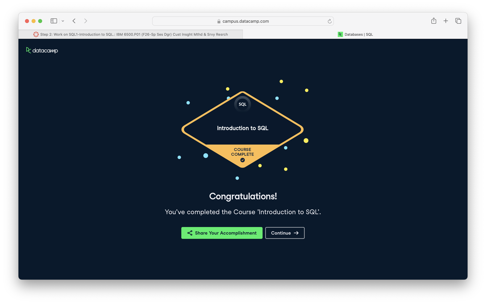

**Course:** IBM 6500 — Customer Insight Methods and Survey Research

# Course-Completion Evidence

I completed the Introduction to SQL course on September 26, 2026. The screenshot below shows the course-completion confirmation from DataCamp.

{width=100%}

# Learning Notes and Key Takeaways

The examples use the course's `leads` and `conversions` tables. They are displayed as SQL reference examples rather than executed during report rendering.

## Main Ideas

A database is an organized collection of data. Database management software provides the tools to store, retrieve, and update that data. In a relational database, data is organized into tables. Each row represents one record, and each column describes an attribute of those records. For example, one row in `leads` represents one lead, while `country` records the lead's country. A primary key uniquely identifies each row; identifiers such as `lead_id` allow individual records to be distinguished even when names are repeated.

SQL stands for Structured Query Language. A query expresses which data to retrieve and how to arrange the results. `SELECT` identifies the columns to return, and `FROM` identifies the table. Selecting a few relevant columns makes results easier to inspect. Selecting columns does not delete the other columns from the database.

### Important SQL syntax

| Syntax | Purpose |
|---|---|
| `SELECT column_name` | Return a named column. |
| `SELECT col1, col2` | Return multiple columns, separated by commas. |
| `SELECT *` | Return all columns. |
| `FROM table_name` | Specify the source table. |
| `ORDER BY column_name ASC` | Sort from lowest to highest. |
| `ORDER BY column_name DESC` | Sort from highest to lowest. |
| `LIMIT n` | Return at most `n` rows. |
| `;` | End a SQL statement. |

### Examples and explanations

**Inspect all columns:**

```sql
SELECT *
FROM conversions;
```

This returns all columns and rows from `conversions`. It is useful for exploring the table before choosing specific fields. Without `ORDER BY`, the returned row order is not guaranteed.

**Select relevant fields:**

```sql
SELECT conversion_id, revenue, status
FROM conversions;
```

This returns the conversion identifier, revenue, and status for each conversion. It does not restrict which rows are returned. Column names must match the table: the amount column in the exercise is `revenue`, not `value`. Checking the Data tab helps prevent column-name errors.

**Find the five highest-revenue conversions:**

```sql
SELECT conversion_id, revenue, status
FROM conversions
ORDER BY revenue DESC
LIMIT 5;
```

The query sorts conversions from highest to lowest revenue and returns the first five. `LIMIT 5` by itself would only restrict the number of rows; it would not identify the highest revenues. For five lowest-revenue conversions, change `DESC` to `ASC`. If revenues are tied, adding `conversion_id` as a second sorting column would make the choice among tied records consistent.

### CEP application

These commands could help inspect a marketing dataset and retrieve only the fields needed for analysis. For example, reviewing the highest- and lowest-revenue conversions could identify records worth investigating. Keeping `status` visible provides context: a conversion with a high recorded amount may still be pending or lost. Ranking amounts alone does not establish realized revenue or explain why a campaign performed well.

# Overall Reflection and Future Reference

The most useful skills from these exercises were selecting relevant columns and combining `ORDER BY` with `LIMIT`. Together, these commands turn a large table into a focused result, such as the five highest- or lowest-revenue conversions. `DISTINCT` was also useful for identifying which categories appear in a dataset without repeated values.

One challenge in the exercises was matching the query to the actual column names. The amount field was named `revenue`, so using `value` caused an error. Another confusing point was a task referring to `total` even though the visible table used `revenue`. This helped clarify the difference between an existing column and an alias: `revenue AS total` changes the output label without adding the values together. Checking the table structure is an important first step when troubleshooting.

My group's CEP project focuses on the Restaurant at Kellogg Ranch. If suitable transaction or marketing data are available, SQL could help us retrieve relevant fields and inspect the highest- and lowest-value records. For example, sorting transaction amounts could identify purchases to investigate further, while a unique list of marketing channels could help us understand which channels are represented. These examples would need to use the restaurant's actual table and column names. The course's conversion data are practice data, not findings about the restaurant.

# Appendix: Publication Links

- [GitHub Repository](https://github.com/gmonjarrez/ibm-6500-sql-learning-portfolio)
- [Published Introduction to SQL Report](https://gmonjarrez.github.io/ibm-6500-sql-learning-portfolio/introduction-to-sql.html)
